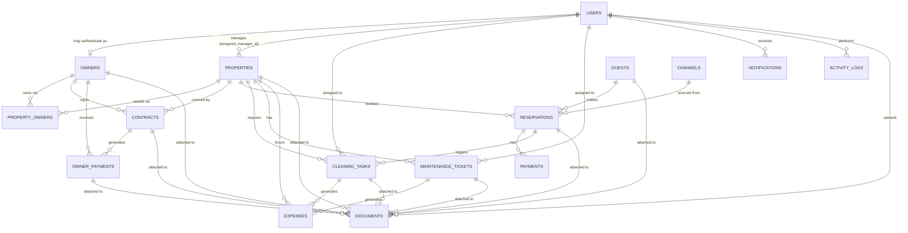

# Amkouy Immobilier — Production Database Schema

**Engine:** PostgreSQL 15+
**Status:** v1.0 — foundation schema for the Critical-tier items in the [Product & Business Audit](#) (team & access, real ledger, trust accounting, property onboarding, task assignment, security deposits, audit trail)
**Scope:** 13 core tables requested, plus 3 supporting tables required for the core tables to be relationally and financially correct (`property_owners`, `channels`, `payments`) — each justified inline below.

---

## 0. Conventions

| Convention | Rule |
|---|---|
| Table names | `snake_case`, plural (`properties`, not `Property`) |
| Primary keys | `UUID DEFAULT gen_random_uuid()` everywhere **except** `activity_logs`, which uses `BIGINT GENERATED ALWAYS AS IDENTITY` — it's a high-volume, insert-only log where sequential scan/index performance matters more than distributed-ID unpredictability. |
| Money | `NUMERIC(14,2)` — never `float`/`double`, to avoid rounding drift on financial totals. |
| Timestamps | `TIMESTAMPTZ`, always UTC in storage; never bare `TIMESTAMP`. |
| Enums | Native Postgres `ENUM` types for stable, small, domain-defining value sets. `ALTER TYPE … ADD VALUE` is transaction-safe on PG12+, so extending an enum later is a safe migration, not a rewrite. |
| Extensions required | `pgcrypto` (UUIDs), `citext` (case-insensitive email), `btree_gist` (the double-booking exclusion constraint on `reservations`). |
| Audit fields | Every table (two documented exceptions) carries `created_at`, `updated_at`, `created_by`, `updated_by`. |
| Soft delete | Every table (two documented exceptions) carries `deleted_at`, `deleted_by`. Nothing is ever `DELETE`d in application code. |

### How this schema answers the audit

| Audit finding (Critical tier) | Schema element |
|---|---|
| #1 No team / role-based access | `users.role` enum + per-table `assigned_to_user_id` / `assigned_manager_id` |
| #2 No trust accounting / fund separation | `payments` (guest funds in) kept structurally separate from `owner_payments` (owner funds out); `owner_payments.status` approval workflow |
| #3 No real payment processing | `payments` table with `gateway_reference`, `status`, `method` |
| #5 No property onboarding workflow | `properties.status` lifecycle (`onboarding → active → …`) |
| #6 No real owner statements | `owner_payments` computed from real rows, not static text; `documents` stores the generated statement PDF |
| #8 No cost-approval workflow | `expenses.approval_status`, `maintenance_tickets.owner_approval_required` / `owner_approved_at` |
| #9 No task assignment/dispatch | `cleaning_tasks.assigned_to_user_id`, `maintenance_tickets.assigned_to_user_id` with status lifecycles |
| #11 No availability grid / double-booking guard | `reservations` `EXCLUDE` constraint (see §4) enforces no-overlap **at the database level** |
| #12 No security deposit tracking | `reservations.security_deposit_amount` + `security_deposit_status`, `payments.type = 'deposit_hold'/'deposit_release'` |
| #13 No audit trail | `activity_logs`, plus `created_by`/`updated_by`/`deleted_by` on every table |
| #14 No asset/equipment history | `maintenance_tickets` + `documents` (category `photo_before`/`photo_after`) per property |

---

## 1. Entity-Relationship Diagram



---

## 2. Enum Types

```sql
CREATE EXTENSION IF NOT EXISTS pgcrypto;
CREATE EXTENSION IF NOT EXISTS citext;
CREATE EXTENSION IF NOT EXISTS btree_gist;

CREATE TYPE user_role            AS ENUM ('super_admin','admin','manager','accountant','cleaner','technician','owner');
CREATE TYPE owner_status         AS ENUM ('prospect','active','inactive');
CREATE TYPE payout_method        AS ENUM ('bank_transfer','check','cash');
CREATE TYPE property_type        AS ENUM ('villa','riad','apartment','studio','other');
CREATE TYPE property_status      AS ENUM ('onboarding','active','maintenance','inactive','archived');
CREATE TYPE contract_status      AS ENUM ('draft','active','expiring_soon','expired','terminated');
CREATE TYPE payout_schedule      AS ENUM ('weekly','biweekly','monthly');
CREATE TYPE owner_payment_status AS ENUM ('pending','approved','processing','paid','failed','cancelled');
CREATE TYPE id_document_type     AS ENUM ('passport','national_id','other');
CREATE TYPE reservation_status   AS ENUM ('pending','confirmed','checked_in','checked_out','completed','cancelled','no_show');
CREATE TYPE deposit_status       AS ENUM ('not_collected','held','partially_released','released','forfeited');
CREATE TYPE payment_type         AS ENUM ('charge','deposit_hold','deposit_release','refund');
CREATE TYPE payment_method_type  AS ENUM ('card','bank_transfer','cash','online_gateway');
CREATE TYPE payment_status       AS ENUM ('pending','completed','failed','cancelled');
CREATE TYPE expense_category     AS ENUM ('cleaning','maintenance','platform_commission','utilities','supplies','insurance','tax','other');
CREATE TYPE approval_status      AS ENUM ('pending','approved','rejected');
CREATE TYPE cleaning_status      AS ENUM ('unassigned','scheduled','in_progress','completed','verified','cancelled');
CREATE TYPE maintenance_category AS ENUM ('plumbing','electrical','hvac','appliance','structural','pest_control','other');
CREATE TYPE maintenance_priority AS ENUM ('low','normal','high','urgent');
CREATE TYPE maintenance_status   AS ENUM ('open','assigned','in_progress','on_hold','resolved','closed');
CREATE TYPE document_category    AS ENUM ('contract','id_verification','invoice','statement','photo_before','photo_after','insurance','other');
CREATE TYPE notification_type    AS ENUM ('reservation','payment','maintenance','cleaning','contract','system');
CREATE TYPE notification_priority AS ENUM ('info','warning','urgent');
CREATE TYPE notification_channel AS ENUM ('in_app','push','email','sms','whatsapp');

-- Reusable trigger: keeps updated_at current on every UPDATE.
CREATE OR REPLACE FUNCTION set_updated_at()
RETURNS TRIGGER AS $$
BEGIN
  NEW.updated_at = now();
  RETURN NEW;
END;
$$ LANGUAGE plpgsql;
```

---

## 3. Core Tables

> Tables below are grouped by business domain for readability, which is **not** the order they can be executed in — `reservations` (§3.7) references `channels` (§4.2), and `expenses` (§3.8) references `maintenance_tickets`/`cleaning_tasks` (§3.9–3.10). See §9 for the actual dependency-safe execution order.

### 3.1 `users`
Every person who can authenticate: staff **and** owners **and**, once portal access ships, guests. Role lives here, not in a separate table — the role set is small, fixed, and domain-defined (Audit Critical #1).

```sql
CREATE TABLE users (
  id              UUID PRIMARY KEY DEFAULT gen_random_uuid(),
  email           CITEXT NOT NULL,
  phone           VARCHAR(20),
  password_hash   TEXT,                      -- NULL if invited via magic-link/SSO only
  full_name       TEXT NOT NULL,
  role            user_role NOT NULL DEFAULT 'cleaner',
  avatar_url      TEXT,
  locale          VARCHAR(5) NOT NULL DEFAULT 'fr',
  is_active       BOOLEAN NOT NULL DEFAULT true,
  mfa_enabled     BOOLEAN NOT NULL DEFAULT false,
  last_login_at   TIMESTAMPTZ,

  created_at      TIMESTAMPTZ NOT NULL DEFAULT now(),
  updated_at      TIMESTAMPTZ NOT NULL DEFAULT now(),
  created_by      UUID REFERENCES users(id),
  updated_by      UUID REFERENCES users(id),
  deleted_at      TIMESTAMPTZ,
  deleted_by      UUID REFERENCES users(id)
);

CREATE UNIQUE INDEX ux_users_email        ON users (email)      WHERE deleted_at IS NULL;
CREATE INDEX        ix_users_role         ON users (role)       WHERE deleted_at IS NULL;
CREATE INDEX        ix_users_is_active    ON users (is_active)  WHERE deleted_at IS NULL;

CREATE TRIGGER trg_users_updated_at BEFORE UPDATE ON users
  FOR EACH ROW EXECUTE FUNCTION set_updated_at();
```

### 3.2 `owners`
The business entity (a property owner), separate from `users` so an owner can exist purely as a financial/contact record and *optionally* gain portal login later — this is what fixes the Owner Portal authentication gap (Audit Critical, screen 12) without conflating "is a customer" with "can log in."

```sql
CREATE TABLE owners (
  id                    UUID PRIMARY KEY DEFAULT gen_random_uuid(),
  user_id               UUID UNIQUE REFERENCES users(id) ON DELETE SET NULL,
  full_name             TEXT NOT NULL,
  company_name          TEXT,
  email                 CITEXT,
  phone                 VARCHAR(20),
  tax_id                TEXT,                 -- CIN / ICE
  bank_name             TEXT,
  bank_iban             TEXT,                 -- encrypt at application/KMS layer
  bank_account_holder   TEXT,
  preferred_payout_method payout_method NOT NULL DEFAULT 'bank_transfer',
  status                owner_status NOT NULL DEFAULT 'prospect',
  notes                 TEXT,

  created_at      TIMESTAMPTZ NOT NULL DEFAULT now(),
  updated_at      TIMESTAMPTZ NOT NULL DEFAULT now(),
  created_by      UUID REFERENCES users(id),
  updated_by      UUID REFERENCES users(id),
  deleted_at      TIMESTAMPTZ,
  deleted_by      UUID REFERENCES users(id)
);

CREATE INDEX ix_owners_status  ON owners (status) WHERE deleted_at IS NULL;
CREATE INDEX ix_owners_user_id ON owners (user_id) WHERE deleted_at IS NULL;

CREATE TRIGGER trg_owners_updated_at BEFORE UPDATE ON owners
  FOR EACH ROW EXECUTE FUNCTION set_updated_at();
```

### 3.3 `properties`
Carries a real status **lifecycle** (Audit Critical #5 — "no listing lifecycle") instead of an implicit always-active state.

```sql
CREATE TABLE properties (
  id                  UUID PRIMARY KEY DEFAULT gen_random_uuid(),
  name                TEXT NOT NULL,
  property_type       property_type NOT NULL DEFAULT 'apartment',
  status              property_status NOT NULL DEFAULT 'onboarding',
  address_line        TEXT,
  city                TEXT NOT NULL,
  region              TEXT,
  postal_code         VARCHAR(10),
  country             CHAR(2) NOT NULL DEFAULT 'MA',
  latitude            NUMERIC(9,6),
  longitude           NUMERIC(9,6),
  bedrooms            SMALLINT,
  bathrooms           SMALLINT,
  area_sqm            NUMERIC(8,2),
  max_guests          SMALLINT,
  amenities           JSONB NOT NULL DEFAULT '[]',
  house_rules         TEXT,
  base_nightly_rate   NUMERIC(12,2),
  cleaning_fee        NUMERIC(10,2) NOT NULL DEFAULT 0,   -- per-property override; fixes hardcoded MAD 300 in the prototype
  currency            CHAR(3) NOT NULL DEFAULT 'MAD',
  min_stay_nights     SMALLINT NOT NULL DEFAULT 1,
  assigned_manager_id UUID REFERENCES users(id) ON DELETE SET NULL,   -- role = 'manager'
  default_cleaner_id  UUID REFERENCES users(id) ON DELETE SET NULL,   -- role = 'cleaner'

  created_at      TIMESTAMPTZ NOT NULL DEFAULT now(),
  updated_at      TIMESTAMPTZ NOT NULL DEFAULT now(),
  created_by      UUID REFERENCES users(id),
  updated_by      UUID REFERENCES users(id),
  deleted_at      TIMESTAMPTZ,
  deleted_by      UUID REFERENCES users(id)
);

CREATE INDEX ix_properties_status            ON properties (status)              WHERE deleted_at IS NULL;
CREATE INDEX ix_properties_city              ON properties (city)                WHERE deleted_at IS NULL;
CREATE INDEX ix_properties_assigned_manager  ON properties (assigned_manager_id) WHERE deleted_at IS NULL;
CREATE INDEX ix_properties_default_cleaner   ON properties (default_cleaner_id)  WHERE deleted_at IS NULL;

CREATE TRIGGER trg_properties_updated_at BEFORE UPDATE ON properties
  FOR EACH ROW EXECUTE FUNCTION set_updated_at();
```

### 3.4 `contracts`
The agency ↔ owner management agreement for a specific property — where commission %, payout schedule, and term live (Audit: Owners screen, "commission % isn't editable/versioned").

```sql
CREATE TABLE contracts (
  id                UUID PRIMARY KEY DEFAULT gen_random_uuid(),
  contract_number   TEXT NOT NULL,
  owner_id          UUID NOT NULL REFERENCES owners(id)    ON DELETE RESTRICT,
  property_id       UUID NOT NULL REFERENCES properties(id) ON DELETE RESTRICT,
  status            contract_status NOT NULL DEFAULT 'draft',
  commission_pct    NUMERIC(5,2) NOT NULL CHECK (commission_pct >= 0 AND commission_pct <= 100),
  payout_schedule   payout_schedule NOT NULL DEFAULT 'monthly',
  start_date        DATE NOT NULL,
  end_date          DATE,
  auto_renew        BOOLEAN NOT NULL DEFAULT false,
  terms             TEXT,

  created_at      TIMESTAMPTZ NOT NULL DEFAULT now(),
  updated_at      TIMESTAMPTZ NOT NULL DEFAULT now(),
  created_by      UUID REFERENCES users(id),
  updated_by      UUID REFERENCES users(id),
  deleted_at      TIMESTAMPTZ,
  deleted_by      UUID REFERENCES users(id),

  CONSTRAINT ck_contracts_dates CHECK (end_date IS NULL OR end_date > start_date)
);

CREATE UNIQUE INDEX ux_contracts_number      ON contracts (contract_number) WHERE deleted_at IS NULL;
CREATE INDEX        ix_contracts_owner       ON contracts (owner_id)       WHERE deleted_at IS NULL;
CREATE INDEX        ix_contracts_property    ON contracts (property_id)    WHERE deleted_at IS NULL;
CREATE INDEX        ix_contracts_status      ON contracts (status)         WHERE deleted_at IS NULL;
-- Only one ACTIVE contract per property at a time:
CREATE UNIQUE INDEX ux_contracts_one_active_per_property
  ON contracts (property_id) WHERE status = 'active' AND deleted_at IS NULL;

CREATE TRIGGER trg_contracts_updated_at BEFORE UPDATE ON contracts
  FOR EACH ROW EXECUTE FUNCTION set_updated_at();
```

### 3.5 `owner_payments`
Money the agency owes and pays **to** the owner — with the approval workflow the audit flagged as entirely missing (Critical #8, #6).

```sql
CREATE TABLE owner_payments (
  id                UUID PRIMARY KEY DEFAULT gen_random_uuid(),
  owner_id          UUID NOT NULL REFERENCES owners(id)    ON DELETE RESTRICT,
  contract_id       UUID REFERENCES contracts(id)          ON DELETE RESTRICT,
  period_start      DATE NOT NULL,
  period_end        DATE NOT NULL,
  gross_revenue     NUMERIC(14,2) NOT NULL DEFAULT 0,
  total_expenses    NUMERIC(14,2) NOT NULL DEFAULT 0,
  commission_amount NUMERIC(14,2) NOT NULL DEFAULT 0,       -- agency's cut, per contract.commission_pct
  net_amount        NUMERIC(14,2) NOT NULL,                 -- gross_revenue - total_expenses - commission_amount
  status            owner_payment_status NOT NULL DEFAULT 'pending',
  approved_by       UUID REFERENCES users(id),
  approved_at       TIMESTAMPTZ,
  paid_at           TIMESTAMPTZ,
  payment_method    payout_method,
  payment_reference TEXT,                                   -- bank transaction reference

  created_at      TIMESTAMPTZ NOT NULL DEFAULT now(),
  updated_at      TIMESTAMPTZ NOT NULL DEFAULT now(),
  created_by      UUID REFERENCES users(id),
  updated_by      UUID REFERENCES users(id),
  deleted_at      TIMESTAMPTZ,
  deleted_by      UUID REFERENCES users(id),

  CONSTRAINT ck_owner_payments_period CHECK (period_end >= period_start)
);

CREATE INDEX ix_owner_payments_owner   ON owner_payments (owner_id)  WHERE deleted_at IS NULL;
CREATE INDEX ix_owner_payments_status  ON owner_payments (status)    WHERE deleted_at IS NULL;
CREATE INDEX ix_owner_payments_period  ON owner_payments (period_start, period_end) WHERE deleted_at IS NULL;

CREATE TRIGGER trg_owner_payments_updated_at BEFORE UPDATE ON owner_payments
  FOR EACH ROW EXECUTE FUNCTION set_updated_at();
```

### 3.6 `guests`
```sql
CREATE TABLE guests (
  id                        UUID PRIMARY KEY DEFAULT gen_random_uuid(),
  full_name                 TEXT NOT NULL,
  email                     CITEXT,
  phone                     VARCHAR(20),
  nationality               CHAR(2),
  id_document_type          id_document_type,
  id_document_number        TEXT,               -- encrypt at application/KMS layer
  id_document_verified_at   TIMESTAMPTZ,         -- fixes "no ID verification" (Audit Critical #10)
  date_of_birth             DATE,
  marketing_opt_in          BOOLEAN NOT NULL DEFAULT false,
  notes                     TEXT,

  created_at      TIMESTAMPTZ NOT NULL DEFAULT now(),
  updated_at      TIMESTAMPTZ NOT NULL DEFAULT now(),
  created_by      UUID REFERENCES users(id),
  updated_by      UUID REFERENCES users(id),
  deleted_at      TIMESTAMPTZ,
  deleted_by      UUID REFERENCES users(id)
);

CREATE INDEX ix_guests_email ON guests (email) WHERE deleted_at IS NULL;
CREATE INDEX ix_guests_phone ON guests (phone) WHERE deleted_at IS NULL;

CREATE TRIGGER trg_guests_updated_at BEFORE UPDATE ON guests
  FOR EACH ROW EXECUTE FUNCTION set_updated_at();
```

### 3.7 `reservations`
The most heavily-constrained table in the schema: a database-level **exclusion constraint** makes double-booking structurally impossible, not just alert-worthy (Audit Critical #11).

```sql
CREATE TABLE reservations (
  id                        UUID PRIMARY KEY DEFAULT gen_random_uuid(),
  reservation_code          TEXT NOT NULL,
  property_id               UUID NOT NULL REFERENCES properties(id) ON DELETE RESTRICT,
  guest_id                  UUID NOT NULL REFERENCES guests(id)     ON DELETE RESTRICT,
  channel_id                UUID NOT NULL REFERENCES channels(id)   ON DELETE RESTRICT,
  status                    reservation_status NOT NULL DEFAULT 'pending',
  check_in_date              DATE NOT NULL,
  check_out_date             DATE NOT NULL,
  nights                     SMALLINT GENERATED ALWAYS AS ((check_out_date - check_in_date)::smallint) STORED,
  adults                     SMALLINT NOT NULL DEFAULT 1,
  children                   SMALLINT NOT NULL DEFAULT 0,
  nightly_rate               NUMERIC(12,2) NOT NULL,
  subtotal_amount             NUMERIC(14,2) NOT NULL,
  cleaning_fee_amount         NUMERIC(12,2) NOT NULL DEFAULT 0,
  tourist_tax_amount          NUMERIC(12,2) NOT NULL DEFAULT 0,   -- taxe de séjour — compliance (Audit Critical #10)
  channel_commission_amount   NUMERIC(14,2) NOT NULL DEFAULT 0,   -- OTA's cut, informational + reconciliation
  total_amount                NUMERIC(14,2) NOT NULL,             -- guest-facing total
  security_deposit_amount     NUMERIC(12,2) NOT NULL DEFAULT 0,
  security_deposit_status     deposit_status NOT NULL DEFAULT 'not_collected',
  currency                    CHAR(3) NOT NULL DEFAULT 'MAD',
  source_reference             TEXT,                 -- external OTA booking ID
  special_requests             TEXT,
  cancellation_reason           TEXT,
  cancelled_at                  TIMESTAMPTZ,

  created_at      TIMESTAMPTZ NOT NULL DEFAULT now(),
  updated_at      TIMESTAMPTZ NOT NULL DEFAULT now(),
  created_by      UUID REFERENCES users(id),
  updated_by      UUID REFERENCES users(id),
  deleted_at      TIMESTAMPTZ,
  deleted_by      UUID REFERENCES users(id),

  CONSTRAINT ck_reservations_dates CHECK (check_out_date > check_in_date)
);

CREATE UNIQUE INDEX ux_reservations_code   ON reservations (reservation_code) WHERE deleted_at IS NULL;
CREATE INDEX        ix_reservations_property ON reservations (property_id, check_in_date, check_out_date) WHERE deleted_at IS NULL;
CREATE INDEX        ix_reservations_guest     ON reservations (guest_id)   WHERE deleted_at IS NULL;
CREATE INDEX        ix_reservations_channel   ON reservations (channel_id) WHERE deleted_at IS NULL;
CREATE INDEX        ix_reservations_status    ON reservations (status)     WHERE deleted_at IS NULL;

-- Hard guarantee against double-booking: no two non-cancelled reservations on the
-- same property may have overlapping date ranges. Requires btree_gist.
ALTER TABLE reservations
  ADD CONSTRAINT ck_reservations_no_overlap
  EXCLUDE USING gist (
    property_id WITH =,
    daterange(check_in_date, check_out_date, '[)') WITH &&
  )
  WHERE (status NOT IN ('cancelled', 'no_show') AND deleted_at IS NULL);

CREATE TRIGGER trg_reservations_updated_at BEFORE UPDATE ON reservations
  FOR EACH ROW EXECUTE FUNCTION set_updated_at();
```

### 3.7a `reservation_services`
Add-on services and upsells sold against a reservation (airport transfers, car rental, private chef, etc.). `total_price` is a generated column (`quantity × unit_price`), matching the `nights` pattern on `reservations` — never write it directly. Revenue reporting treats `status = 'cancelled'` rows as excluded from totals; every other status counts.

```sql
CREATE TYPE reservation_service_name AS ENUM (
  'airport_pickup','airport_dropoff','car_rental','extra_cleaning',
  'early_check_in','late_check_out','laundry','private_chef',
  'maid_service','tours_activities'
);
CREATE TYPE reservation_service_status AS ENUM ('offered','accepted','scheduled','delivered','cancelled');

CREATE TABLE reservation_services (
  id              UUID PRIMARY KEY DEFAULT gen_random_uuid(),
  reservation_id  UUID NOT NULL REFERENCES reservations(id) ON DELETE CASCADE,
  service_name    reservation_service_name NOT NULL,
  quantity        SMALLINT NOT NULL DEFAULT 1 CHECK (quantity > 0),
  unit_price      NUMERIC(12,2) NOT NULL DEFAULT 0 CHECK (unit_price >= 0),
  total_price     NUMERIC(14,2) GENERATED ALWAYS AS (quantity * unit_price) STORED,
  status          reservation_service_status NOT NULL DEFAULT 'offered',
  notes           TEXT,
  created_at      TIMESTAMPTZ NOT NULL DEFAULT now(),
  updated_at      TIMESTAMPTZ NOT NULL DEFAULT now(),
  created_by      UUID REFERENCES users(id),
  updated_by      UUID REFERENCES users(id),
  deleted_at      TIMESTAMPTZ,
  deleted_by      UUID REFERENCES users(id)
);

CREATE INDEX ix_reservation_services_reservation ON reservation_services (reservation_id) WHERE deleted_at IS NULL;
CREATE INDEX ix_reservation_services_status ON reservation_services (status) WHERE deleted_at IS NULL;

CREATE TRIGGER trg_reservation_services_updated_at BEFORE UPDATE ON reservation_services
  FOR EACH ROW EXECUTE FUNCTION set_updated_at();

ALTER TABLE reservation_services ENABLE ROW LEVEL SECURITY;
CREATE POLICY allow_all_temp_reservation_services ON reservation_services FOR ALL USING (true) WITH CHECK (true);
```

> **RLS note:** every table in this schema runs with a temporary permissive `FOR ALL USING (true)` policy applied directly in Supabase (not shown elsewhere in this document, since the original migration predates this note) — there is no real per-role access control yet, matching Audit Critical #1. Replace with real policies once auth ships.

### 3.8 `expenses`
Every cost, tagged by category, with the owner cost-approval gate the audit called the "single most common source of owner disputes" (Critical #8).

```sql
CREATE TABLE expenses (
  id                          UUID PRIMARY KEY DEFAULT gen_random_uuid(),
  property_id                 UUID REFERENCES properties(id) ON DELETE RESTRICT,   -- nullable: agency-wide overhead
  contract_id                 UUID REFERENCES contracts(id)  ON DELETE RESTRICT,
  category                    expense_category NOT NULL,
  description                 TEXT NOT NULL,
  amount                      NUMERIC(14,2) NOT NULL CHECK (amount >= 0),
  currency                    CHAR(3) NOT NULL DEFAULT 'MAD',
  expense_date                DATE NOT NULL,
  vendor_name                 TEXT,
  related_maintenance_ticket_id UUID REFERENCES maintenance_tickets(id) ON DELETE SET NULL,
  related_cleaning_task_id      UUID REFERENCES cleaning_tasks(id)      ON DELETE SET NULL,
  reimbursable_to_owner        BOOLEAN NOT NULL DEFAULT true,
  approval_status               approval_status NOT NULL DEFAULT 'pending',
  approved_by                   UUID REFERENCES users(id),
  approved_at                   TIMESTAMPTZ,

  created_at      TIMESTAMPTZ NOT NULL DEFAULT now(),
  updated_at      TIMESTAMPTZ NOT NULL DEFAULT now(),
  created_by      UUID REFERENCES users(id),
  updated_by      UUID REFERENCES users(id),
  deleted_at      TIMESTAMPTZ,
  deleted_by      UUID REFERENCES users(id)
);

CREATE INDEX ix_expenses_property ON expenses (property_id)     WHERE deleted_at IS NULL;
CREATE INDEX ix_expenses_category ON expenses (category)        WHERE deleted_at IS NULL;
CREATE INDEX ix_expenses_date     ON expenses (expense_date)    WHERE deleted_at IS NULL;
CREATE INDEX ix_expenses_approval ON expenses (approval_status) WHERE deleted_at IS NULL;

CREATE TRIGGER trg_expenses_updated_at BEFORE UPDATE ON expenses
  FOR EACH ROW EXECUTE FUNCTION set_updated_at();
```

### 3.9 `cleaning_tasks`
A `verified` status separates the cleaner's own checklist from manager sign-off — the audit's "no quality check separate from self-report" finding.

```sql
CREATE TABLE cleaning_tasks (
  id                  UUID PRIMARY KEY DEFAULT gen_random_uuid(),
  property_id         UUID NOT NULL REFERENCES properties(id)   ON DELETE RESTRICT,
  reservation_id       UUID REFERENCES reservations(id)          ON DELETE SET NULL,  -- null = ad-hoc/deep clean
  assigned_to_user_id UUID REFERENCES users(id)                 ON DELETE SET NULL,  -- role = 'cleaner'
  status               cleaning_status NOT NULL DEFAULT 'unassigned',
  scheduled_date       DATE NOT NULL,
  scheduled_time       TIME,
  started_at            TIMESTAMPTZ,
  completed_at           TIMESTAMPTZ,
  verified_by             UUID REFERENCES users(id),
  verified_at              TIMESTAMPTZ,
  checklist                JSONB NOT NULL DEFAULT '[]',            -- [{ "item": "...", "done": true }]
  cost_amount               NUMERIC(10,2),                          -- actual cleaner pay, vs. what's billed to owner
  notes                     TEXT,

  created_at      TIMESTAMPTZ NOT NULL DEFAULT now(),
  updated_at      TIMESTAMPTZ NOT NULL DEFAULT now(),
  created_by      UUID REFERENCES users(id),
  updated_by      UUID REFERENCES users(id),
  deleted_at      TIMESTAMPTZ,
  deleted_by      UUID REFERENCES users(id)
);

CREATE INDEX ix_cleaning_tasks_property   ON cleaning_tasks (property_id)          WHERE deleted_at IS NULL;
CREATE INDEX ix_cleaning_tasks_assignee   ON cleaning_tasks (assigned_to_user_id)  WHERE deleted_at IS NULL;
CREATE INDEX ix_cleaning_tasks_reservation ON cleaning_tasks (reservation_id)      WHERE deleted_at IS NULL;
-- "Today's ops" is the single hottest query in this table:
CREATE INDEX ix_cleaning_tasks_schedule ON cleaning_tasks (scheduled_date, status) WHERE deleted_at IS NULL;

CREATE TRIGGER trg_cleaning_tasks_updated_at BEFORE UPDATE ON cleaning_tasks
  FOR EACH ROW EXECUTE FUNCTION set_updated_at();
```

### 3.10 `maintenance_tickets`
Carries the owner-approval gate and SLA timestamp the audit flagged as missing (Critical #8, Important #SLA).

```sql
CREATE TABLE maintenance_tickets (
  id                       UUID PRIMARY KEY DEFAULT gen_random_uuid(),
  ticket_number            TEXT NOT NULL,
  property_id              UUID NOT NULL REFERENCES properties(id) ON DELETE RESTRICT,
  reported_by               UUID REFERENCES users(id),
  assigned_to_user_id      UUID REFERENCES users(id) ON DELETE SET NULL,  -- role = 'technician'
  category                  maintenance_category NOT NULL DEFAULT 'other',
  priority                  maintenance_priority NOT NULL DEFAULT 'normal',
  status                    maintenance_status NOT NULL DEFAULT 'open',
  issue_summary              TEXT NOT NULL,
  description                 TEXT,
  estimated_cost               NUMERIC(10,2),
  actual_cost                    NUMERIC(10,2),
  owner_approval_required        BOOLEAN NOT NULL DEFAULT false,
  owner_approved_by               UUID REFERENCES owners(id),
  owner_approved_at                TIMESTAMPTZ,
  sla_due_at                        TIMESTAMPTZ,     -- derived from priority at creation
  resolved_at                        TIMESTAMPTZ,

  created_at      TIMESTAMPTZ NOT NULL DEFAULT now(),
  updated_at      TIMESTAMPTZ NOT NULL DEFAULT now(),
  created_by      UUID REFERENCES users(id),
  updated_by      UUID REFERENCES users(id),
  deleted_at      TIMESTAMPTZ,
  deleted_by      UUID REFERENCES users(id)
);

CREATE UNIQUE INDEX ux_maintenance_tickets_number ON maintenance_tickets (ticket_number) WHERE deleted_at IS NULL;
CREATE INDEX ix_maintenance_tickets_property   ON maintenance_tickets (property_id)          WHERE deleted_at IS NULL;
CREATE INDEX ix_maintenance_tickets_assignee   ON maintenance_tickets (assigned_to_user_id)  WHERE deleted_at IS NULL;
CREATE INDEX ix_maintenance_tickets_status     ON maintenance_tickets (status)               WHERE deleted_at IS NULL;
CREATE INDEX ix_maintenance_tickets_priority   ON maintenance_tickets (priority)              WHERE deleted_at IS NULL;
CREATE INDEX ix_maintenance_tickets_sla        ON maintenance_tickets (sla_due_at)            WHERE deleted_at IS NULL AND status NOT IN ('resolved','closed');

CREATE TRIGGER trg_maintenance_tickets_updated_at BEFORE UPDATE ON maintenance_tickets
  FOR EACH ROW EXECUTE FUNCTION set_updated_at();
```

### 3.11 `notifications`
```sql
CREATE TABLE notifications (
  id                   UUID PRIMARY KEY DEFAULT gen_random_uuid(),
  user_id              UUID NOT NULL REFERENCES users(id) ON DELETE CASCADE,
  type                 notification_type NOT NULL,
  title                TEXT NOT NULL,
  body                 TEXT,
  related_entity_type  TEXT,          -- e.g. 'reservation', 'maintenance_ticket' — for deep-linking
  related_entity_id    UUID,
  priority             notification_priority NOT NULL DEFAULT 'info',
  channel              notification_channel NOT NULL DEFAULT 'in_app',
  read_at              TIMESTAMPTZ,
  sent_at              TIMESTAMPTZ,

  created_at      TIMESTAMPTZ NOT NULL DEFAULT now(),
  updated_at      TIMESTAMPTZ NOT NULL DEFAULT now(),
  created_by      UUID REFERENCES users(id),
  updated_by      UUID REFERENCES users(id),
  deleted_at      TIMESTAMPTZ,
  deleted_by      UUID REFERENCES users(id)
);

CREATE INDEX ix_notifications_user_unread ON notifications (user_id, read_at) WHERE deleted_at IS NULL;
CREATE INDEX ix_notifications_entity      ON notifications (related_entity_type, related_entity_id);
CREATE INDEX ix_notifications_created     ON notifications (created_at DESC);

CREATE TRIGGER trg_notifications_updated_at BEFORE UPDATE ON notifications
  FOR EACH ROW EXECUTE FUNCTION set_updated_at();
```

### 3.12 `documents`
A **typed** polymorphic association: one nullable FK column per owning entity plus a `CHECK` that exactly one is set. This keeps real, indexable, cascade-capable foreign keys instead of an untyped `(documentable_type, documentable_id)` pair that Postgres can't enforce referential integrity on.

```sql
CREATE TABLE documents (
  id                     UUID PRIMARY KEY DEFAULT gen_random_uuid(),
  category               document_category NOT NULL,
  contract_id            UUID REFERENCES contracts(id)          ON DELETE CASCADE,
  property_id            UUID REFERENCES properties(id)         ON DELETE CASCADE,
  reservation_id         UUID REFERENCES reservations(id)       ON DELETE CASCADE,
  owner_id               UUID REFERENCES owners(id)             ON DELETE CASCADE,
  guest_id               UUID REFERENCES guests(id)              ON DELETE CASCADE,
  maintenance_ticket_id  UUID REFERENCES maintenance_tickets(id) ON DELETE CASCADE,
  cleaning_task_id       UUID REFERENCES cleaning_tasks(id)      ON DELETE CASCADE,
  owner_payment_id       UUID REFERENCES owner_payments(id)      ON DELETE CASCADE,
  file_name              TEXT NOT NULL,
  file_url               TEXT NOT NULL,      -- object storage path (S3/GCS)
  mime_type              TEXT,
  file_size_bytes        BIGINT,
  uploaded_by             UUID REFERENCES users(id),
  is_signed                BOOLEAN NOT NULL DEFAULT false,
  signed_at                 TIMESTAMPTZ,

  created_at      TIMESTAMPTZ NOT NULL DEFAULT now(),
  updated_at      TIMESTAMPTZ NOT NULL DEFAULT now(),
  created_by      UUID REFERENCES users(id),
  updated_by      UUID REFERENCES users(id),
  deleted_at      TIMESTAMPTZ,
  deleted_by      UUID REFERENCES users(id),

  CONSTRAINT ck_documents_single_parent CHECK (
    num_nonnulls(contract_id, property_id, reservation_id, owner_id, guest_id,
                 maintenance_ticket_id, cleaning_task_id, owner_payment_id) = 1
  )
);

CREATE INDEX ix_documents_contract    ON documents (contract_id)           WHERE deleted_at IS NULL;
CREATE INDEX ix_documents_property    ON documents (property_id)           WHERE deleted_at IS NULL;
CREATE INDEX ix_documents_reservation ON documents (reservation_id)        WHERE deleted_at IS NULL;
CREATE INDEX ix_documents_owner       ON documents (owner_id)              WHERE deleted_at IS NULL;
CREATE INDEX ix_documents_guest       ON documents (guest_id)              WHERE deleted_at IS NULL;
CREATE INDEX ix_documents_maintenance ON documents (maintenance_ticket_id) WHERE deleted_at IS NULL;
CREATE INDEX ix_documents_cleaning    ON documents (cleaning_task_id)      WHERE deleted_at IS NULL;
CREATE INDEX ix_documents_owner_payment ON documents (owner_payment_id)    WHERE deleted_at IS NULL;
CREATE INDEX ix_documents_category    ON documents (category)              WHERE deleted_at IS NULL;

CREATE TRIGGER trg_documents_updated_at BEFORE UPDATE ON documents
  FOR EACH ROW EXECUTE FUNCTION set_updated_at();
```

### 3.13 `activity_logs`
**Intentionally exempt** from the audit-field and soft-delete conventions above — see §6. This table *is* the audit mechanism for every other table; logging its own edits recursively serves no purpose, and an append-only log must never be edited or "soft deleted" without defeating its purpose.

```sql
CREATE TABLE activity_logs (
  id           BIGINT GENERATED ALWAYS AS IDENTITY PRIMARY KEY,
  user_id      UUID REFERENCES users(id) ON DELETE SET NULL,  -- NULL = system-initiated
  action       TEXT NOT NULL,        -- dot-namespaced, e.g. 'reservation.created', 'owner_payment.approved'
  entity_type  TEXT NOT NULL,        -- 'reservation', 'contract', 'owner_payment', ...
  entity_id    UUID NOT NULL,
  changes      JSONB,                -- { "before": {...}, "after": {...} }
  ip_address   INET,
  user_agent   TEXT,
  created_at   TIMESTAMPTZ NOT NULL DEFAULT now()
);

CREATE INDEX ix_activity_logs_entity  ON activity_logs (entity_type, entity_id);
CREATE INDEX ix_activity_logs_user    ON activity_logs (user_id);
CREATE INDEX ix_activity_logs_action  ON activity_logs (action);
CREATE INDEX ix_activity_logs_created ON activity_logs (created_at DESC);
```

> **Scale note:** at 500 properties, this table will be the highest-volume in the database within a year or two. Plan to convert it to a range-partitioned table (`PARTITION BY RANGE (created_at)`, monthly partitions) before it becomes a maintenance problem — trivial to do from day one, expensive to retrofit later.

---

## 4. Supporting Tables

These three are not on the requested core-table list, but the core tables cannot be relationally or financially correct without them.

### 4.1 `property_owners` — *required by: `properties`, `owners`*
A property can have co-owners (split ownership); an owner can hold many properties. This many-to-many relationship cannot be modeled as a single FK column on either side.

```sql
CREATE TABLE property_owners (
  id              UUID PRIMARY KEY DEFAULT gen_random_uuid(),
  property_id     UUID NOT NULL REFERENCES properties(id) ON DELETE CASCADE,
  owner_id        UUID NOT NULL REFERENCES owners(id)     ON DELETE CASCADE,
  ownership_pct   NUMERIC(5,2) NOT NULL DEFAULT 100 CHECK (ownership_pct > 0 AND ownership_pct <= 100),
  is_primary      BOOLEAN NOT NULL DEFAULT false,

  created_at TIMESTAMPTZ NOT NULL DEFAULT now(),
  updated_at TIMESTAMPTZ NOT NULL DEFAULT now(),

  CONSTRAINT ux_property_owners_pair UNIQUE (property_id, owner_id)
);

CREATE INDEX ix_property_owners_property ON property_owners (property_id);
CREATE INDEX ix_property_owners_owner    ON property_owners (owner_id);
-- Exactly one primary owner per property:
CREATE UNIQUE INDEX ux_property_owners_one_primary
  ON property_owners (property_id) WHERE is_primary = true;

CREATE TRIGGER trg_property_owners_updated_at BEFORE UPDATE ON property_owners
  FOR EACH ROW EXECUTE FUNCTION set_updated_at();
```
*Not soft-deleted:* a junction row's lifecycle is "linked or not linked" — there is no meaningful "deleted but still there" state. Ownership history lives in `activity_logs`, not in this table. The invariant "percentages across all owners of a property sum to 100" spans multiple rows and is enforced at the application layer (or a constraint trigger), not a single-row `CHECK`.

### 4.2 `channels` — *required by: `reservations`*
Airbnb, Booking.com, and Direct each carry their own commission rate. Hardcoding "MAD 640" per booking (as the prototype does) makes correct commission math impossible once a second channel or a rate change exists.

```sql
CREATE TABLE channels (
  id                     UUID PRIMARY KEY DEFAULT gen_random_uuid(),
  code                   TEXT NOT NULL,             -- 'direct' | 'airbnb' | 'booking_com' | ...
  name                   TEXT NOT NULL,
  default_commission_pct NUMERIC(5,2) NOT NULL DEFAULT 0,
  api_config             JSONB,                      -- future channel-manager credentials
  is_active              BOOLEAN NOT NULL DEFAULT true,

  created_at      TIMESTAMPTZ NOT NULL DEFAULT now(),
  updated_at      TIMESTAMPTZ NOT NULL DEFAULT now(),
  created_by      UUID REFERENCES users(id),
  updated_by      UUID REFERENCES users(id),
  deleted_at      TIMESTAMPTZ,
  deleted_by      UUID REFERENCES users(id)
);

CREATE UNIQUE INDEX ux_channels_code ON channels (code) WHERE deleted_at IS NULL;

CREATE TRIGGER trg_channels_updated_at BEFORE UPDATE ON channels
  FOR EACH ROW EXECUTE FUNCTION set_updated_at();

-- Seed data: every deployment needs at least a "Direct" channel.
INSERT INTO channels (code, name, default_commission_pct) VALUES
  ('direct', 'Réservation directe', 0);
```

### 4.3 `payments` — *required by: `reservations`*
Money **received from guests** (charges, deposit holds/releases, refunds) — structurally separate from `owner_payments` (money paid **to owners**). This separation is the schema-level implementation of trust accounting (Audit Critical #2): the two flows can never be commingled because they are different tables with different keys.

```sql
CREATE TABLE payments (
  id                 UUID PRIMARY KEY DEFAULT gen_random_uuid(),
  reservation_id     UUID NOT NULL REFERENCES reservations(id) ON DELETE RESTRICT,
  type               payment_type NOT NULL,
  amount             NUMERIC(14,2) NOT NULL,
  currency           CHAR(3) NOT NULL DEFAULT 'MAD',
  method             payment_method_type NOT NULL,
  status             payment_status NOT NULL DEFAULT 'pending',
  gateway_reference  TEXT,             -- payment processor transaction ID
  processed_at       TIMESTAMPTZ,

  created_at      TIMESTAMPTZ NOT NULL DEFAULT now(),
  updated_at      TIMESTAMPTZ NOT NULL DEFAULT now(),
  created_by      UUID REFERENCES users(id),
  updated_by      UUID REFERENCES users(id),
  deleted_at      TIMESTAMPTZ,
  deleted_by      UUID REFERENCES users(id)
);

CREATE INDEX ix_payments_reservation ON payments (reservation_id) WHERE deleted_at IS NULL;
CREATE INDEX ix_payments_status      ON payments (status)         WHERE deleted_at IS NULL;
CREATE INDEX ix_payments_type        ON payments (type)           WHERE deleted_at IS NULL;

CREATE TRIGGER trg_payments_updated_at BEFORE UPDATE ON payments
  FOR EACH ROW EXECUTE FUNCTION set_updated_at();
```

---

## 5. Table Relationships (Reference)

| From | Column | References | On Delete | Cardinality |
|---|---|---|---|---|
| users | created_by / updated_by / deleted_by | users.id | — (self) | many→one |
| owners | user_id | users.id | SET NULL | one→one (optional) |
| owners | created_by / updated_by / deleted_by | users.id | — | many→one |
| properties | assigned_manager_id | users.id | SET NULL | many→one |
| properties | default_cleaner_id | users.id | SET NULL | many→one |
| property_owners | property_id | properties.id | CASCADE | many→one |
| property_owners | owner_id | owners.id | CASCADE | many→one |
| contracts | owner_id | owners.id | RESTRICT | many→one |
| contracts | property_id | properties.id | RESTRICT | many→one |
| owner_payments | owner_id | owners.id | RESTRICT | many→one |
| owner_payments | contract_id | contracts.id | RESTRICT | many→one |
| owner_payments | approved_by | users.id | — | many→one |
| reservations | property_id | properties.id | RESTRICT | many→one |
| reservations | guest_id | guests.id | RESTRICT | many→one |
| reservations | channel_id | channels.id | RESTRICT | many→one |
| payments | reservation_id | reservations.id | RESTRICT | many→one |
| reservation_services | reservation_id | reservations.id | CASCADE | many→one |
| expenses | property_id | properties.id | RESTRICT | many→one |
| expenses | contract_id | contracts.id | RESTRICT | many→one |
| expenses | related_maintenance_ticket_id | maintenance_tickets.id | SET NULL | many→one |
| expenses | related_cleaning_task_id | cleaning_tasks.id | SET NULL | many→one |
| cleaning_tasks | property_id | properties.id | RESTRICT | many→one |
| cleaning_tasks | reservation_id | reservations.id | SET NULL | many→one |
| cleaning_tasks | assigned_to_user_id | users.id | SET NULL | many→one |
| maintenance_tickets | property_id | properties.id | RESTRICT | many→one |
| maintenance_tickets | assigned_to_user_id | users.id | SET NULL | many→one |
| maintenance_tickets | owner_approved_by | owners.id | — | many→one |
| notifications | user_id | users.id | CASCADE | many→one |
| documents | contract_id / property_id / reservation_id / owner_id / guest_id / maintenance_ticket_id / cleaning_task_id / owner_payment_id | respective `.id` | CASCADE | many→one (exactly one non-null) |
| activity_logs | user_id | users.id | SET NULL | many→one |

**Every table above** additionally carries `created_by`, `updated_by`, `deleted_by → users.id` (omitted from the table for brevity), **except** `activity_logs` and `property_owners` — see §6 for why those two are exempt.

---

## 6. Audit Fields Strategy

- **`created_at` / `updated_at`** — set by default and by the shared `set_updated_at()` trigger; never set by application code, so they can be trusted even if a bug exists upstream.
- **`created_by` / `updated_by`** — who, not just when. Nullable only for system/seed-data rows.
- **`activity_logs`** — the detailed layer: every meaningful state transition (`reservation.confirmed`, `owner_payment.approved`, `contract.terminated`, …) is written here with a JSON before/after diff, independent of the row-level `updated_by`. This is what makes a financial dispute or a compliance audit answerable with a query instead of a guess.
- **Two exceptions, both deliberate:**
  1. `activity_logs` itself has no `updated_at`/`updated_by` — it is insert-only. An audit log that can be edited is not an audit log.
  2. `property_owners` has no `created_by`/`updated_by` — a two-column join row with no independent business meaning; the *why* behind an ownership change belongs in `activity_logs` against the `property` or `owner` entity, not duplicated here.

## 7. Soft Delete Strategy

- Every table except `activity_logs` and `property_owners` carries `deleted_at TIMESTAMPTZ NULL` and `deleted_by UUID NULL`. Application code never issues `DELETE` on these tables — it issues `UPDATE … SET deleted_at = now(), deleted_by = :user_id`.
- **Every query filters `WHERE deleted_at IS NULL`** by default. In practice this is enforced once, centrally, via an ORM default scope or a Postgres `VIEW` per table (e.g. `CREATE VIEW active_properties AS SELECT * FROM properties WHERE deleted_at IS NULL;`) rather than remembered per-query.
- **Uniqueness must be partial, not global.** A plain `UNIQUE (email)` on `users` would permanently block re-registering a deleted user's email. Every uniqueness constraint in this schema is written as `CREATE UNIQUE INDEX … WHERE deleted_at IS NULL` for exactly this reason.
- **Hard-delete is a separate, rare, administrative path** — used only for GDPR-style erasure requests on `guests`/`users` PII, run manually, logged in `activity_logs` before the row disappears, never triggered by normal application flow. This is also why most foreign keys use `ON DELETE RESTRICT` or `SET NULL` rather than `CASCADE`: a hard delete should fail loudly against a business entity with financial history (a `contract` cannot be hard-deleted while `owner_payments` reference it) rather than silently cascade away money records.
- **Retention:** recommend a scheduled job that permanently purges soft-deleted rows older than the applicable legal retention window (typically 5–10 years for financial records in Morocco) — a policy decision for Finance/Legal to set, not a default baked into the schema.

## 8. Indexing Strategy

- **Every foreign key is indexed.** Postgres does not do this automatically (unlike the primary key side); every FK above has a matching `ix_*` index to keep joins and `ON DELETE` checks fast.
- **Every partial index respects soft delete** (`WHERE deleted_at IS NULL`), keeping indexes smaller and query plans accurate as deleted rows accumulate over years of operation.
- **Composite indexes match real query shapes**, not just single columns: `(property_id, check_in_date, check_out_date)` for availability lookups, `(scheduled_date, status)` for "today's cleaning queue," `(sla_due_at)` filtered to open tickets for SLA-breach alerting.
- **The one non-btree index** is the `gist` exclusion constraint on `reservations`, which is simultaneously an index and a hard data-integrity guarantee — the rare case where the index *is* the business rule.

---

## 9. Suggested Migration Order

Tables must be created in FK-dependency order:

```
1.  users
2.  owners
3.  channels
4.  properties
5.  property_owners
6.  contracts
7.  guests
8.  reservations
8a. reservation_services  (depends on reservations; added after the initial 16-table migration)
9.  payments
10. owner_payments
11. cleaning_tasks
12. maintenance_tickets
13. expenses
14. documents
15. notifications
16. activity_logs
```

Run each `CREATE TABLE` through a real migration tool (e.g. `node-pg-migrate`, `Prisma Migrate`, `Flyway`, or plain numbered `.sql` files under version control) rather than applying this document directly to production — this schema has not been executed against a live PostgreSQL instance in this environment and should be validated in staging first.
